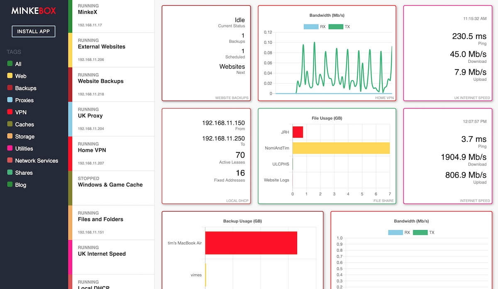

* MinkeBox

MinkeBox is an Open Source project designed to make it simple to run Dockerized applications at home. Docker might have already revolutionized how companies run massively parallel applications, but it also has the potential to simplify running all those useful little applications at home. Need a VPN into your home or office? Need a Wiki or a Webserver? Backups? Cache all those huge Steam downloads for you friends or roommates? Maybe even run a Minecraft server for you and your friends? These things already exists as Docker apps, and MinkeBox aims to make it easy to get them running.

